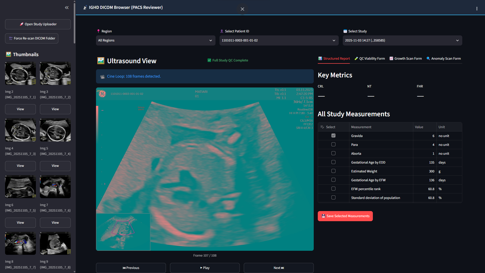

 
# 📡 IGHD DICOM Viewer, QC & Upload System

[](https://www.python.org/)
[](https://fastapi.tiangolo.com/)
[](https://streamlit.io/)
[](https://www.docker.com/)
[](https://www.nginx.com/)
[](LICENSE)

A containerized, microservice-based ultrasound PACS reviewer, clinical Quality Control (QC) assessment platform, and fast DICOM folder upload engine designed for maternal-fetal research workflows.

---

## 🌟 Key Features

* **PACS Viewport & Cine Player:** Full DICOM image viewer with multi-frame cine loop controls, playback speed adjustment, and instant series frame switching.
* **Structured Report (SR) Extractor:** Automatic parsing of ultrasound SR measurements (Crown-Rump Length, Nuchal Translucency, Fetal Heart Rate) with selective persistence into clinical study records.
* **Multi-Tier Quality Control (QC) Engine:** Structured evaluation forms for **Viability**, **Growth**, and **Anomaly** scans with direct evidence-image attachment and jump-to-image verification.
* **Fast Directory Uploads:** Client-side directory compression via JSZip combined with asynchronous background extraction on the FastAPI backend for rapid cohort transfers.
* **Ground-Truth File Verification:** Real-time auditing comparing total physical disk files against successfully parsed DICOM instances to flag corrupted transfers or OS system files (`Thumbs.db`).
* **Operator Multi-Tier Fallback:** Automatic clinician assignment resolving saved QC records, `OperatorsName` (0008,1070), `PerformingPhysicianName` (0008,1050), or `PatientID` suffix mapping.

---

## 🏗️ System Architecture

```text
                       ┌─────────────────────────────────────────┐
                       │           Nginx Reverse Proxy           │
                       │               (Port 80)                 │
                       └──────────────────┬──────────────────────┘
                                          │
       ┌──────────────────────────────────┼──────────────────────────────────┐
       │ /dicomviewer/                    │ /dicomsuploader/                 │ /dicomserver/
       ▼                                  ▼                                  ▼
┌──────────────────────────┐    ┌──────────────────────────┐    ┌──────────────────────────┐
│  Streamlit PACS Viewer   │    │ Streamlit Upload Client  │    │   FastAPI Backend API    │
│  (dicom_browser_app.py)  │    │ (dicom_upload_client.py) │    │ (dicom_upload_server.py) │
│        Port 8501         │    │        Port 8503         │    │        Port 8502         │
└──────────────┬───────────┘    └─────────────┬────────────┘    └─────────────┬────────────┘
               │                              │                               │
               └──────────────────────────────┼───────────────────────────────┘
                                              │
                                              ▼
                                 ┌─────────────────────────┐
                                 │ Shared Storage Volumes  │
                                 │  /raw_data   /qc_data   │
                                 └─────────────────────────┘
```

| Service | Technology | Port | Access Path | Function |
| :--- | :--- | :--- | :--- | :--- |
| **PACS Viewer** | Streamlit | `8501` | `/dicomviewer/` | Image viewing, cine playback, SR extraction, QC forms |
| **Upload Client** | Streamlit + JS | `8503` | `/dicomsuploader/` | Client-side archiving, upload progress, server inventory |
| **Backend API** | FastAPI + Uvicorn | `8502` | `/dicomserver/` | Async zip extraction, DICOM header indexing, health checks |
| **Reverse Proxy** | Nginx | `80` | `/` | Microservice routing, WebSocket upgrades, timeout limits |

---

## 📸 Screenshots Showcase

| PACS Viewer & Cine Player | Server Inventory & File Verification |
| :---: | :---: |
|  |  |

| Clinical QC Assessment & Evidence | Active DICOM Tag Inspector |
| :---: | :---: |
|  |  |

---

## 📂 Project Structure

```text
ighd-dicom-system/
├── .gitignore                  # Strict PHI & dataset exclusions
├── README.md                   # Project documentation
├── docker-compose.yml          # Container orchestration specification
├── requirements.txt            # Core Python dependencies
├── docs/
│   └── images/                 # Repository screenshot assets
│       ├── DICOM_viewer_main.jpg
│       ├── DICOM_study_inventory.jpg
│       ├── DICOM_qc_form_assessment.jpg
│       └── DICOM_metadata_inspector.jpg
├── nginx/
│   └── nginx.conf              # Reverse proxy routing rules
├── apps/
│   ├── dicom_browser_app.py    # Streamlit PACS Browser & QC Viewer
│   ├── dicom_upload_client.py  # Streamlit Upload Dashboard & Inventory UI
│   └── dicom_upload_server.py  # FastAPI Processing, Extraction & Indexing API
└── scripts/
    └── dicom_attribute_scanner.py # Command-line header inspection utility
```

---

## 🚀 Quick Start

### Prerequisites
* [Docker Desktop](https://www.docker.com/products/docker-desktop/) or Docker Engine v20.10+
* Docker Compose v2.0+

### 1. Clone Repository & Setup
```bash
git clone https://github.com/YOUR_ORGANIZATION/ighd-dicom-system.git
cd ighd-dicom-system
```

### 2. Launch Container Environment
```bash
docker-compose up -d --build
```

### 3. Access Services
* **DICOM PACS Viewer:** `http://localhost/dicomviewer/`
* **Upload Client Dashboard:** `http://localhost/dicomsuploader/`
* **Backend Health Check:** `http://localhost/dicomserver/health`

---

## ⚙️ Environment Variables

| Variable | Default Value | Description |
| :--- | :--- | :--- |
| `DICOM_DIR` / `OUTPUT_DIR` | `/raw_data` | Root path for storing unpacked raw DICOM datasets |
| `QC_FILE` | `/qc_data/study_qc.json` | Persistent storage path for completed clinical QC records |
| `UPLOAD_SERVER_URL` | `http://localhost/dicomserver` | External API route used by browser clients |
| `VIEWER_URL` | `http://localhost/dicomviewer` | External viewer URL for inventory dashboard links |

---

## 🛡️ PHI Protection & Data Security

This repository is configured with strict security defaults to prevent accidental commits of **Protected Health Information (PHI)**:
* Git tracking is explicitly disabled for all DICOM files (`*.dcm`, `*.DCM`), archive files (`*.zip`), `/raw_data/` directories, and saved JSON QC outputs (`/qc_data/`).
* Never commit real patient imaging data to version control. Always test using de-identified or synthetic DICOM cohorts.
